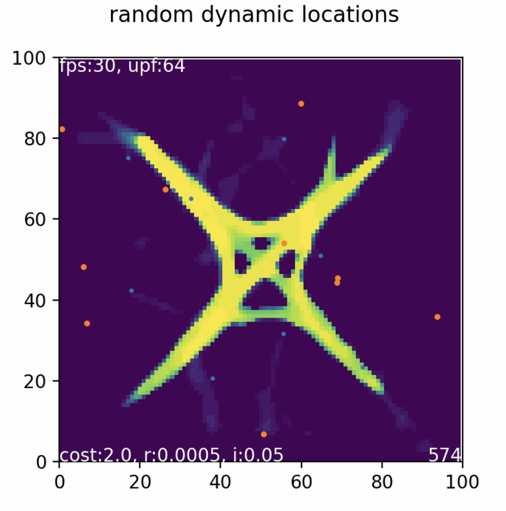

## Referees:

- Caitlyn Lee
- Xiaojie Niu

## Background

When animals or people walk, they can leave a trail of flattened ground, compacted snow, etc., that is easier to walk on. This comprises a positive feedback loop, which leads to emergent paths and entire emergent transportation networks.

The process by which such networks form is not well understood. The three story threads are:

1. Urban planning, where these paths are called "desire paths."
2. Ecology, animal movement and behavior, where these paths are called "game trails."
3. Pure theory.

The dual problem of optimizing a network for minimal line length (infrastructure) and minimal distance cost between points (travel time) ("the transportation problem"), which is related, but not identical to "the Euclidean Steiner problem" of connecting points minimally in Euclidean space. How well does a greedy, naive and minimal collective algorithm solve these problems?
	
## Objectives

I have a v0 simulation model and some preliminary results, but I've hit a computational bottleneck. My goal is to rewrite the simulation code, and in particular use a continuous-space any-directional iterative search algorithm designed for traversing a weighted polyhedral surface.

Goals for this week:

- implement the Kanai-Suzuki search algorithm (Kanai, Suzuki 2001)
- reimplement the simulation and visualization
- produce some new, richer results to continue to think about

Larger questions

- What are the dynamics of network formation? What features are stable/unstable?
- What is the topology of emergent transportation networks, for given parameters and "scenarios"? ("Scenario" refers to the rules for which locations the walkers walk towards, and the overall shape of the world. The model parameters are: trail formation rate, trail disappearance rate, and trail preference strength (trail vs non-trail cost).)
- How do the (1) travel costs, (2) infrastructure costs, and (3) entropy of the network relate to one-another, and to the model parameters & scenarios?

My eventual goal is to answer as many of these larger questions as possible. I've discovered in particular a seemingly-fractal shape to the emergent network in scenarios that include randomly distributed and shifting locations, and I think the theoretical question of what (likely fractal) network structure most optimally collects _regions_ of space (1d, in one scenario; 2d in another) is interesting.

## Model description

- Agents ("walkers") navigate a continuous 2 dimensional space parameterized by cost-of-traversal values. The cost-of-traversal values are approximated with a discrete grid.
- Walkers, to an approximation, take the least costly path to their targets.
- The cost value of the ground is evolves such that walking along the ground makes a that part of the ground less costly to walk on, but this improvement gradually recovers back towards its maximum cost value when it's not walked on.

{ width=50% }
